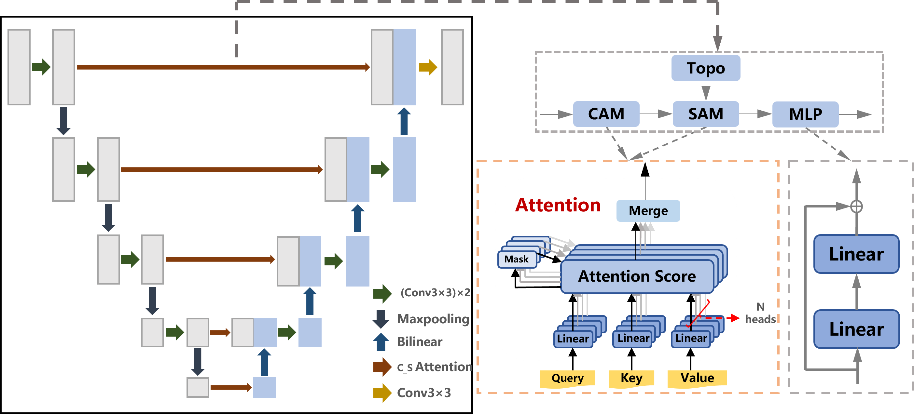
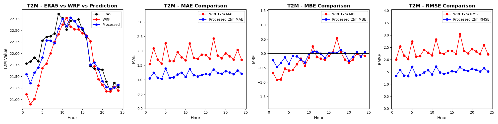
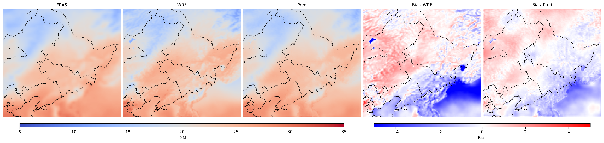

# WRF-ERA5 Correction (TS-UNet)
A WRF–ERA5 correction model based on U-Net with spatial and temporal attention.
The implementation follows the  original logic of data loading, temporal feature engineering, ERA5→WRF bilinear interpolation, and difference-target construction.


## Features
1. Temporal features (sin/cos encodings of hour of day and day of year)
2. ERA5 fields bilinearly interpolated onto the WRF grid, with target defined as `diff = ERA5_interp – WRF`
3. U-Net + windowed spatial attention + temporal attention + residual MLP blocks
4. Visualization: temporal line plots and global bias maps ready to generate
## Project Structure
```text
TS-Unet/
├─ data/ …
├─ save/ …
├─ scripts/train.py
└─ src/wrfera/ …
```

## Example Outputs
**Hourly line plots:** 

**Spatial distribution maps:** 



